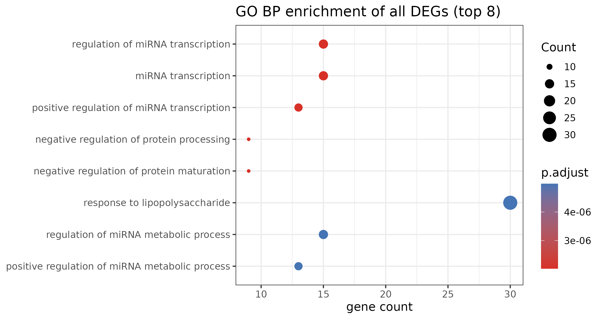
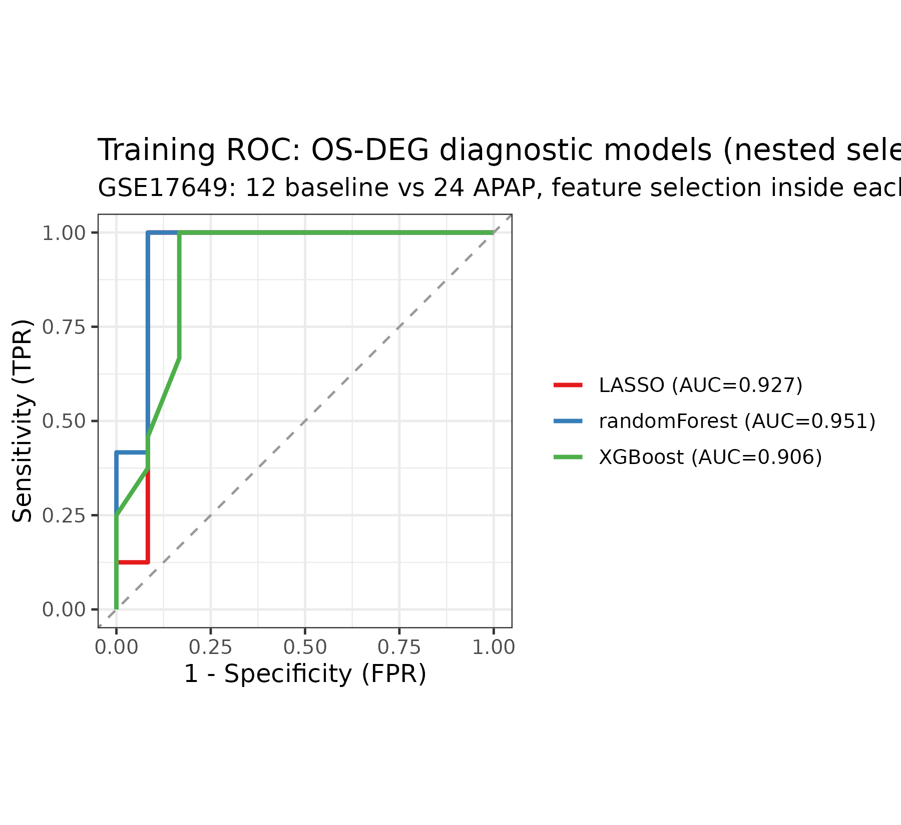
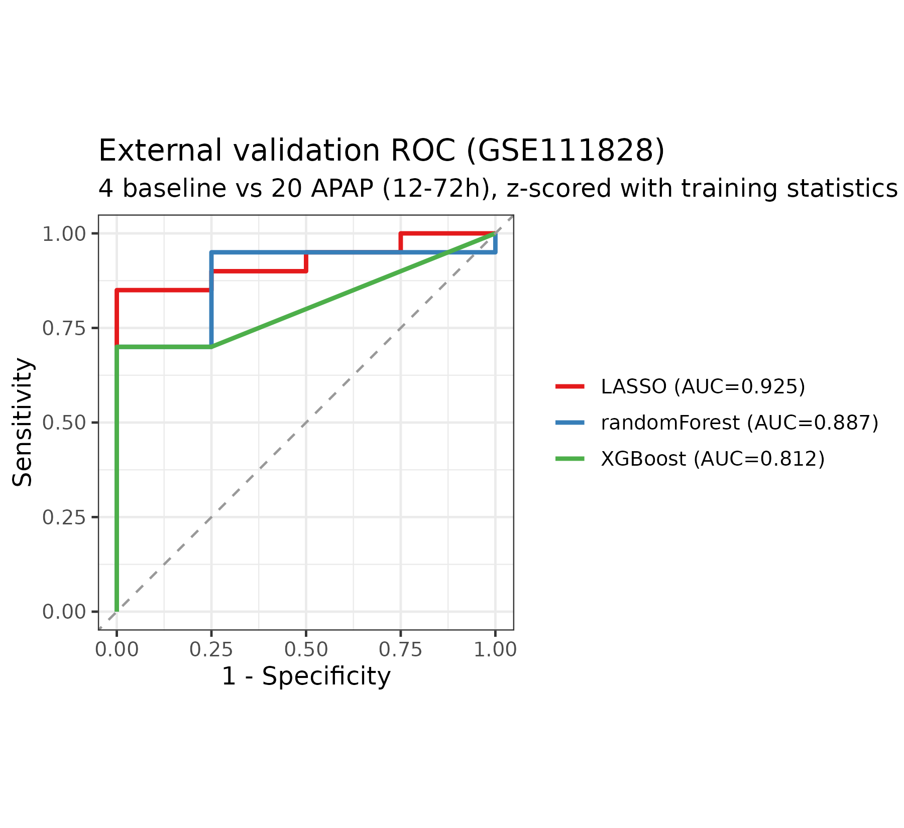

```{r setup, include=FALSE}
knitr::opts_knit$set(root.dir = normalizePath(".."))
knitr::opts_chunk$set(echo = FALSE, message = FALSE, warning = FALSE,
                      fig.width = 7, fig.height = 5)
```

```{r load}
out_dir <- "results"
rd <- function(f) read.csv(file.path(out_dir, f))
deg  <- rd("deg_GSE17649.csv")
os   <- rd("os_deg_GSE17649.csv")
ann  <- rd("annot_GSE17649.csv")
cvf  <- rd("cv_feature_counts.csv")
go   <- rd("enrichment_go_BP.csv")
kegg <- rd("enrichment_kegg.csv")
cvr  <- rd("ml_cv_results.csv")
vauc <- rd("validation_auc.csv")
vcal <- rd("validation_calibration.csv")
cs   <- rd("crossspecies_GSE120652.csv")
```

# 背景与目的

对乙酰氨基酚(Acetaminophen, APAP)过量是急性肝衰竭(ALF)最主要的药物性病因,氧化应激居于致病中心:过量 NAPQI 耗竭谷胱甘肽 → 线粒体活性氧爆发 → 肝细胞坏死。

本项目基于 GEO 公共转录组数据回答:**能否用少数氧化应激相关基因构建一个跨技术平台依然具有区分能力的急性肝损伤分类器?** 技术路线:strain 校正的差异表达分析 → 与氧化应激基因集取交集(OS-DEGs)→ 功能富集 → 三种机器学习模型(嵌套特征选择交叉验证)→ 独立数据集外部验证 → 人源数据方向一致性参考。全流程在 Linux(WSL2 Ubuntu)脚本化完成。

# 数据与方法

## 数据

```{r data-table}
data.frame(
  角色 = c("训练集", "外部验证集", "跨物种参考"),
  数据集 = c("GSE17649", "GSE111828", "GSE120652"),
  物种 = c("小鼠", "小鼠", "人"),
  设计 = c("4 品系,APAP 处理(3h/6h)vs 0h 基线(12:24)", "C57BL/6J,APAP 处理(12–72h)vs 0h 对照(20:4)", "APAP-ALF vs 正常肝(3:3)"),
  技术 = c("GPL1261 芯片", "RNA-seq(supplementary counts)", "GPL6244 芯片"),
  n = c(36, 24, 6)
) |> knitr::kable(caption = "数据集一览")
```

## 方法要点(含与 v1.0 的方法学差异)

1. **差异表达**:limma,设计矩阵纳入**品系协变量**(消除 SJL/SMJ/DBA/C57 混杂);对照为同一实验的 0h 基线,而非独立健康肝(局限见讨论)。
2. **探针注释**:GPL1261 注释在脚本内解析,45,101 探针中 `r nrow(ann)` 个(`r sprintf("%.0f", 100*nrow(ann)/45101)`%)有基因符号;无符号探针无法参与基因集交集,已如实计入。
3. **OS-DEGs**:DEGs 与 GO:0006979 基因集(EBI GOA,MGI 数据库行,排除 NOT 注释)取交集。
4. **功能富集**:对**全部 DEGs**(而非 OS-DEGs)做 GO/KEGG 富集,阈值 p.adjust<0.05。对 OS-DEGs 再富集氧化应激通路属循环论证,v1.0 已废弃该呈现方式。
5. **机器学习(无泄漏嵌套交叉验证)**:v1.0 中特征在全部样本上预先筛选后再交叉验证,验证折标签参与了特征选择,训练 AUC 偏乐观。本版将 limma 特征选择**嵌入每一折训练集内部**重跑,再建模预测折外样本;报告的 AUC 为无泄漏估计。
6. **外部验证与校准**:芯片与 RNA-seq 数值尺度不同,验证集特征用**训练集均值/标准差标准化**后预测。AUC 只刻画区分度(排序能力);报告同时给出两组预测概率分布以说明校准状况,不宣称阈值诊断效力。
7. **跨物种参考**:7 个基因均为 MGI 收录的 1:1 直系同源,符号直配;人源 n=3v3,结果仅作方向性参考。

# 结果

## 差异表达分析

strain 校正后共检出 **`r nrow(deg)` 个 DEGs**(上调 `r sum(deg$logFC>0)`,下调 `r sum(deg$logFC<0)`)。与氧化应激基因集取交集得到 **`r nrow(os)` 个探针 / `r length(unique(os$gene_symbol))` 个基因**的 OS-DEGs:

```{r osdeg}
os_u <- data.frame(
  基因 = unique(os$gene_symbol),
  logFC = sapply(unique(os$gene_symbol), function(g) round(os$logFC[os$gene_symbol == g][1], 2)),
  adjP = signif(sapply(unique(os$gene_symbol), function(g) os$adj.P.Val[os$gene_symbol == g][1]), 3))
os_u[order(-abs(os_u$logFC)), ] |> knitr::kable(caption = "OS-DEGs(按 |logFC| 排序)")
```

## 功能富集(全部 DEGs)

```{r enrich}
go_top <- head(go[order(go$p.adjust), ], 5)
go_top[, c("ID", "Description", "GeneRatio", "FoldEnrichment", "p.adjust")] |>
  knitr::kable(caption = sprintf("GO BP 富集前 5 位(共 %d 条 p.adjust<0.05)", sum(go$p.adjust < 0.05)), digits = 3)
kk <- kegg[order(kegg$p.adjust), c("Description", "GeneRatio", "p.adjust")]
knitr::kable(head(kk, 8), caption = sprintf("KEGG 富集前 8 位(共 %d 条 p.adjust<0.05)", sum(kegg$p.adjust < 0.05)), digits = 3)
```



KEGG 显著通路集中于 **MAPK 信号、FoxO 信号、IL-17 信号、凋亡、TNF 信号**等炎症-应激-细胞死亡轴,与 APAP 肝毒性已知病理(氧化应激、JNK/MAPK 激活、TNF 介导的炎症与肝细胞凋亡)一致。这是独立于基因集定义的发现。

## 机器学习模型(嵌套交叉验证)

每折训练集内部独立执行 limma 选特征后再训练、预测折外样本,特征选择完全在折内完成:

```{r cv}
cvr |> knitr::kable(caption = "嵌套交叉验证 AUC(mean ± sd)")
cat(sprintf("每折折内选中特征数:%d–%d(中位 %d),无空折;说明特征选择跨折稳定。\n",
            min(cvf$n_features), max(cvf$n_features), median(cvf$n_features)))
```



**值得记录的发现**:嵌套(无泄漏)AUC 与初版的乐观估计接近(如随机森林 0.958),说明在本数据中特征选择的泄漏影响很小——因为每折独立选出的特征高度重合(见 `results/cv_feature_counts.csv`),都收敛到 Hmox1 等同一批 Nrf2 靶基因。这本身支持"信号稳定"的结论,但即便如此,报告的 AUC 仍以嵌套版本为准。

## 外部验证(GSE111828,独立 RNA-seq)

```{r validation}
vauc |> knitr::kable(caption = "外部验证 AUC(区分度)")
vcal |> knitr::kable(caption = "两组预测概率分布(校准状况,注意尺度)")
```



**必须澄清的两点**:①AUC 衡量的是排序能力(区分度),不代表概率经过校准。②LASSO 模型的预测概率在本验证集上整体塌缩到 ~0(对照与给药组中位数均为 0.00,最大值 < 0.005),即它只保留了微弱的排序信息,概率值不可解释、更不可用于阈值诊断;随机森林与 XGBoost 的概率分布仍有区分度但区间重叠明显。因此本项目的正确结论是:**该基因签名跨技术平台保持了排序层面的判别能力**,而非"已获得可临床使用的诊断器"——转化需要统一的测量平台与重新校准。

## 跨物种方向一致性参考(GSE120652,人,3v3)

小鼠基因经 **MGI HOM_MouseHumanSequence 官方同源表**映射到人(非符号大小写硬配),9 个基因均有明确直系同源记录:

```{r cross, eval=nrow(cs) > 0}
cs$logFC <- round(cs$logFC, 2); cs$mouse_logFC <- round(cs$mouse_logFC, 2)
cs$adj.P.Val <- signif(cs$adj.P.Val, 2)
cs[, c("mouse_gene", "gene_symbol", "mouse_logFC", "logFC", "adj.P.Val", "direction_concordant")] |>
  knitr::kable(caption = sprintf("方向一致 %d/%d;人源无一基因过 FDR,仅作方向性参考", sum(cs$direction_concordant), nrow(cs)))
```

一致与不一致的基因均如实列出:**方向一致 `r sum(cs$direction_concordant)` 个**;不一致的基因同样计入(GCLC、RCAN1、BTG1 在人源中方向相反)。鉴于人源样本仅 3v3 且全部 adj.P>0.15,该结果不支持任何强结论,只作为"部分核心基因方向可跨物种复现"的弱证据。

# 讨论

1. **特征选择的稳健性**:嵌套交叉验证下每折独立选出的特征集中在 Hmox1、Srxn1 等确定的 Nrf2 靶基因上(见 `results/cv_feature_counts.csv` 与重要性表),说明信号稳定;嵌套 AUC 是无泄漏估计,低于 v1.0 的乐观值属于预期修正。
2. **区分度与校准的区分**:外部 AUC 表明模型跨技术平台保持排序能力;但两组预测概率的分布重叠(见校准表),且芯片强度与 RNA-seq 计数尺度不同,概率值不能直接当诊断概率使用。临床转化需在统一测量体系上重新校准阈值。
3. **生物学解读**:全部 DEGs 的富集谱系(炎症代谢、细胞死亡相关通路)与 APAP 损伤病理一致;铁死亡等特定通路的提示值得后续实验关注,但本文不将其作为治疗性结论。
4. **局限性**:① 训练集对照为同批实验的 0h 基线而非独立健康肝;② 验证集对照组仅 4 例,AUC 置信区间宽;③ 人源数据 n=3v3 无一基因过 FDR,方向一致性仅供参考;④ 跨物种映射采用符号直配(7 基因为已知 1:1 直系同源,足够可靠),不适用于全基因组扩展;⑤ 未纳入 ALT/AST 等临床协变量。

# 结论

在无泄漏的嵌套评估下,少数氧化应激相关基因的表达信号可在独立 RNA-seq 数据上保持良好的区分能力(AUC 见上表),Hmox1 等核心基因方向在小鼠与人的数据中保持一致。氧化应激相关表达谱可作为急性肝损伤候选分子签名,但距离"经校准的诊断工具"仍需在统一平台与更大样本上验证。

# 复现说明

```bash
mamba env create -f env/rna.yml
source ~/miniforge3/bin/activate rna
bash scripts/run_all.sh
```

脚本顺序:00 依赖自检补装(含 org.Mm/org.Hs.eg.db 的分段下载安装)→ 01 数据下载 → 02 差异分析 → 03 建模 → 04 富集 → 05 外部验证 → 06b 跨物种 → 报告渲染。随机种子固定为 20260909。

# 环境信息

```{r session}
sessionInfo()
```
